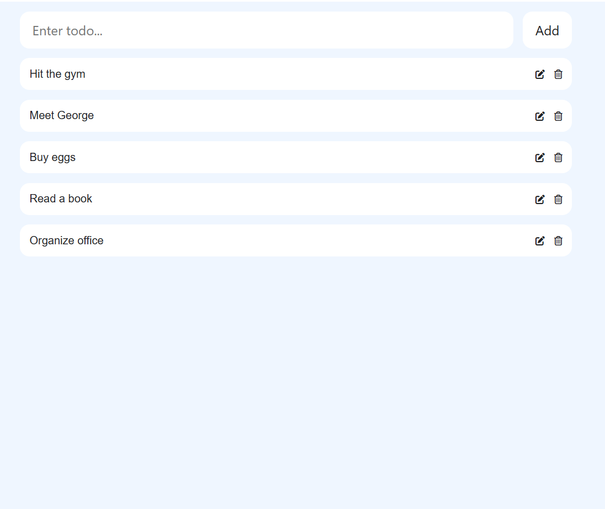
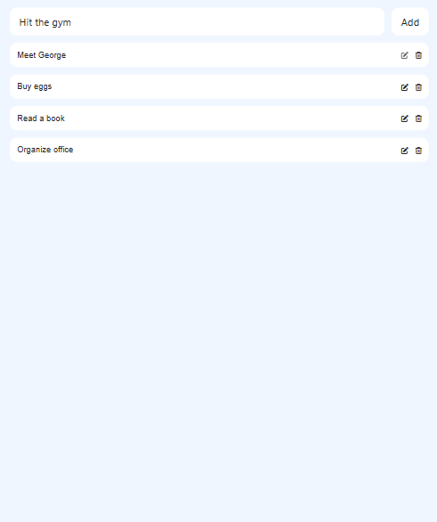

# Todolist ✅

Todolist is a simple and intuitive to-do list web app designed to help you manage tasks efficiently. It allows users to add, edit, and delete tasks, keeping your daily activities organized and productive.

---

## ✨ Features
- **Add Tasks**: Easily add new tasks with titles and descriptions.
- **Edit Tasks**: Edit existing tasks to update their details.
- **Delete Tasks**: Remove tasks from your list when they're no longer needed.
- **Local Storage**: Tasks are stored in your browser’s local storage for persistence.
- **Responsive Design**: Optimized for both mobile and desktop devices.

---

## 🛠️ Tech Stack
- **Frontend**: HTML, CSS, JavaScript
- **Storage**: LocalStorage for saving tasks
- **Styling**: Custom CSS for a clean and simple UI

---

## 🚀 Getting Started

### Prerequisites
- No installation required for the live demo.
- To run the project locally:
  1. Clone the repository:
     ```bash
     git clone https://github.com/Yaser-123/todolist.git
     ```
  2. Navigate to the project directory:
     ```bash
     cd todolist
     ```
  3. Open `index.html` in your browser to run the app locally.

---

## 🎥 Demo

Check out a demo of Todolist in action:


---
<p align="center">
  
</p>
---

## 🤝 Contributing
Contributions are welcome! Please follow the steps below to contribute:
1. Fork the repository.
2. Create a new branch (`git checkout -b feature/YourFeature`).
3. Commit your changes (`git commit -m 'Add YourFeature'`).
4. Push to the branch (`git push origin feature/YourFeature`).
5. Open a Pull Request.

---

## 📜 License
This project is licensed under the **MIT License**. See the [LICENSE](LICENSE) file for details.

---

## 📬 Contact
- **Author**: [Yaser-123](https://github.com/Yaser-123)
- **Linkedin**: http://linkedin.com/in/mohamedyaser08/
- Feel free to raise an [issue](https://github.com/Yaser-123/todolist/issues) for suggestions or queries.

---

Give this project a ⭐ if you find it helpful for managing your tasks efficiently!
